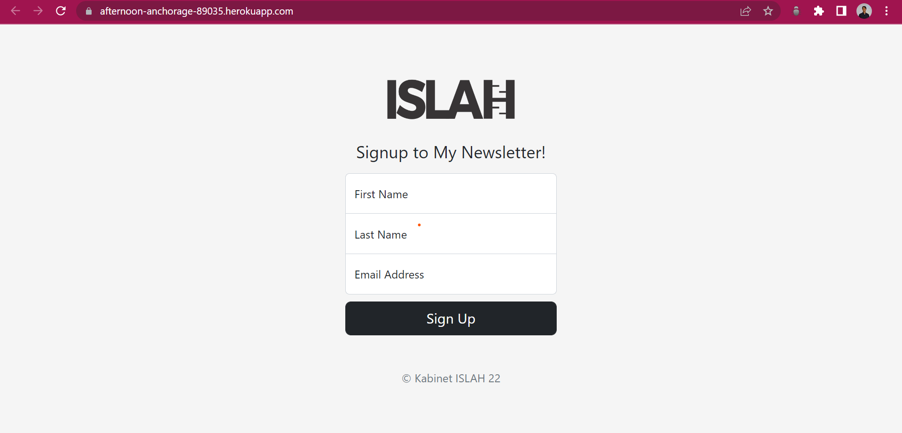
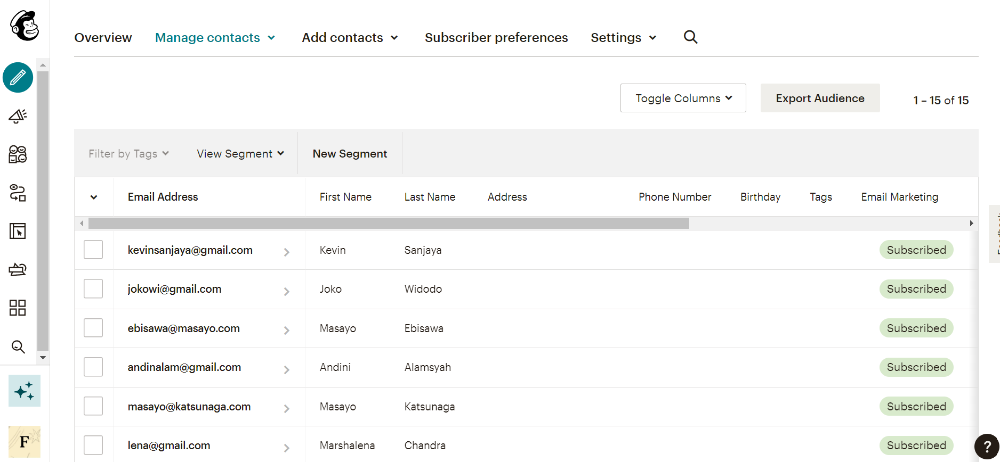

# Newsletter-Signup

## Descriptions

Newsletter-Signup is a personal project focusing on MailChimp API, where I, as the developer of the website, would ask users to sign up if they want to subscribe for my newsletter.
Once they signed up for my newsletter, their data will be stored in MailChimp thorugh their API. If the user succeeded signing up, they would be inform by the success page, otherwise
they would be asked to sign up again or should contact the developer.




(Note that the users informations above are not real and valid)

## Usage

To use the project files, you can either just download the .ZIP file and extract it, or you can just clone this repo by going into your terminal and type
```bash
git clone https://github.com/NatureBase/Newsletter-Signup.git
```
(Note that you must specify where you want to clone the repository by changing the directory in your terminal).

Before open the files and use them, there are several dependencies that you must download first in your working directory, they are
- @mailchimp/mailchimp_marketing version `v3.0.78`
- body-parser version `v1.20.0`
- express version `v4.18.1`
- request version `v2.88.2`

## Technologies and Frameworks

Currently, I am hosting this project on Heroku (only until the end of November), you can access it via this link https://afternoon-anchorage-89035.herokuapp.com , 
and for frameworks I am using is Bootstrap 5 for simple UI design and Mailchimp for storing the subscribed users.

## License

ISC
